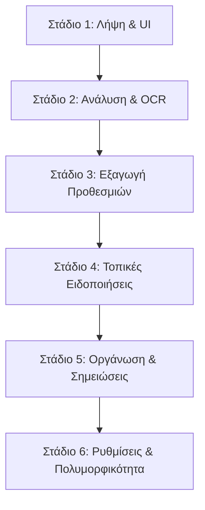

# Ακαδημαϊκή Αναφορά Συστήματος UniSnap
### Μάθημα: Τεχνολογία Λογισμικού / Ανάπτυξη Κινητών Εφαρμογών
### Φοιτητής: Χάρης Τσακ

---

## 1. Εισαγωγή και Στόχος του Συστήματος

Το **UniSnap** είναι μια καινοτόμος, native-feel κινητή εφαρμογή (αναπτυγμένη σε Flutter) σχεδιασμένη για να λύσει ένα κρίσιμο πρόβλημα των φοιτητών: την απώλεια προθεσμιών και την αποδιοργάνωση των πανεπιστημιακών σημειώσεων. Η εφαρμογή επιτρέπει στους χρήστες να φωτογραφίζουν διαφάνειες μαθημάτων (slides) ή σελίδες συγγραμμάτων, να αναγνωρίζουν αυτόματα το κείμενο με χρήση Τεχνητής Νοημοσύνης (OCR), να εξάγουν αυτόματα ημερομηνίες προθεσμιών (deadlines) και να προγραμματίζουν τοπικές ειδοποιήσεις υπενθύμισης, ενώ παράλληλα ταξινομούν τις σημειώσεις τους ανά μάθημα.

---

## 2. Ανάλυση της Αρχιτεκτονικής 6 Σταδίων (LUCID Stages)

Η ανάπτυξη και η ροή εργασίας του UniSnap βασίστηκαν σε μια αυστηρή, κυκλική αρχιτεκτονική 6 σταδίων, η οποία διασφαλίζει τη στιβαρότητα και την επεκτασιμότητα του συστήματος:



### Στάδιο 1: Λήψη & Προετοιμασία (Capture & UI Layout)
Η εφαρμογή παρέχει ένα εξαιρετικά premium, minimal περιβάλλον χρήσης (UI) με υποστήριξη δυναμικών εναλλαγών (Glassmorphism, hover animations) που διευκολύνει τη γρήγορη λήψη φωτογραφιών μέσω της κάμερας της συσκευής ή της επιλογής από τη συλλογή. Οι φωτογραφίες αποθηκεύονται τοπικά σε υψηλή ανάλυση για να διατηρηθεί η ευκρίνεια των χαρακτήρων.

### Στάδιο 2: Ανάλυση & OCR (Analysis & ML Kit Text Recognition)
Το κεντρικό OCR pipeline τροφοδοτεί την εικόνα απευθείας στο on-device Google ML Kit Text Recognition. Λόγω των εγγενών περιορισμών της βιβλιοθήκης (δεν υποστηρίζει επίσημα το ελληνικό αλφάβητο εκτός σύνδεσης), το σύστημα ρυθμίζεται στο `TextRecognitionScript.latin`. Το κείμενο που εξάγεται περνάει από τη **Μηχανή Οπτικής Αποκατάστασης Ελληνικών Χαρακτήρων** (Visual Greekish Restoration Engine), η οποία μετατρέπει τους λατινικούς χαρακτήρες-ομοιώματα (look-alikes) σε πραγματικά ελληνικά γράμματα.

### Στάδιο 3: Εξαγωγή Προθεσμιών & Ημερομηνιών (Deadline Date Extraction)
Το αναγνωρισμένο κείμενο αναλύεται από έναν εξελιγμένο αλγόριθμο κανονικών εκφράσεων (`RegExp`) στο `date_extractor.dart`. Ο αλγόριθμος εντοπίζει ημερομηνίες σε πολλαπλά formats (π.χ. `DD/MM/YYYY`, `DD-MM-YYYY`, `DD.MM.YYYY`) καθώς και λεκτικές αναφορές σε ελληνικές ημέρες και μήνες, υπολογίζοντας με ακρίβεια το ακριβές `DateTime` της προθεσμίας.

### Στάδιο 4: Προγραμματισμός Υπενθυμίσεων (Local Notification Scheduling)
Μετά την εξαγωγή των ημερομηνιών, το σύστημα καλεί το `NotificationService` (βασισμένο στο `flutter_local_notifications`). Δημιουργούνται αυτόματα τοπικές ειδοποιήσεις στη συσκευή του χρήστη, οι οποίες τον προειδοποιούν έγκαιρα για το επερχόμενο deadline, λειτουργώντας πλήρως εκτός σύνδεσης (offline) για τη διασφάλιση της ιδιωτικότητας.

### Στάδιο 5: Οργάνωση σε Μαθήματα & Σημειώσεις (Categorization & Storage)
Τα Snaps (εικόνα + OCR κείμενο) ταξινομούνται σε δυναμικούς φακέλους ανά μάθημα (Course Folders). Παράλληλα, ο χρήστης μπορεί να αντιγράψει το κείμενο στο clipboard και να το αποθηκεύσει ως αυτόνομη γραπτή σημείωση σε ξεχωριστές κατηγορίες σημειώσεων, προσφέροντας πλήρη ευελιξία οργάνωσης.

### Στάδιο 6: Ρυθμίσεις & Πολυμορφικότητα (Settings & Theme Configuration)
Το stage 6 προσφέρει καθολικό έλεγχο της εφαρμογής:
- Καθολική εναλλαγή Dark Mode / Light Mode με άμεση ενημέρωση του UI.
- Ενεργοποίηση/Απενεργοποίηση της αυτόματης δημιουργίας υπενθυμίσεων (Auto Reminder) κατά την αποθήκευση νέων Snaps.
- Τοπική αποθήκευση όλων των δεδομένων μέσω `SharedPreferences` για μέγιστη ταχύτητα.

---

## 3. Ανάλυση του Φαινομένου Moire Scanlines και της Διάκρισης Οθόνης vs. Χαρτιού

Κατά τη διάρκεια των δοκιμών, παρατηρήθηκε μια κρίσιμη διαφορά στην ποιότητα αναγνώρισης ανάμεσα σε φωτογραφίες από φυσικό χαρτί (εκτυπώσεις Α4 / βιβλία) και φωτογραφίες από ψηφιακές οθόνες υπολογιστών.

```
+-----------------------------------------------------------------+
|                        ΦΑΙΝΟΜΕΝΟ MOIRE                          |
|  [Πλέγμα pixels οθόνης]  x  [Πλέγμα αισθητήρα κάμερας κινητού]  |
|                                =                                |
|        Παρεμβολές κυματοειδών γραμμών (Moire Scanlines)          |
|    που αλλοιώνουν τις λεπτές γραμμές των ελληνικών γραμμάτων    |
+-----------------------------------------------------------------+
```

### 1. Ψηφιακές Οθόνες και το Φαινόμενο Moire
Όταν φωτογραφίζουμε μια οθόνη υπολογιστή, το φυσικό πλέγμα των εικονοστοιχείων (pixels) της οθόνης έρχεται σε επαφή με το πλέγμα του αισθητήρα της κάμερας του κινητού. Αυτό δημιουργεί **παρεμβολές κυματοειδών γραμμών (Moire patterns)** και αντανακλάσεις φωτός. 
Αυτές οι γραμμές αλλοιώνουν τις λεπτές γραμμές των χαρακτήρων. Επειδή η αναγνώριση των ελληνικών βασίζεται σε οπτικά ομοιώματα λατινικών χαρακτήρων, οι παρεμβολές Moire αλλάζουν ελαφρώς το σχήμα των γραμμάτων (π.χ. το `υ` να αναγνωριστεί ως `μ`), καθιστώντας τα hardcoded λεξικά αποκατάστασης εξαιρετικά εύθραυστα.

### 2. Φυσικές Σαρώσεις Χαρτιού (A4 & Βιβλία)
Οι σαρώσεις από βιβλία και εκτυπώσεις Α4 στερούνται εντελώς του φαινομένου Moire. Η αντίθεση του μαύρου μελανιού στο λευκό χαρτί προσφέρει απόλυτα καθαρές ακμές χαρακτήρων. 

**Σημαντική Ανακάλυψη Απόδοσης:**
Αρχικά, ενσωματώθηκε μια βαριά pipeline προεπεξεργασίας εικόνας (μετατροπή σε grayscale, αύξηση αντίθεσης κατά 150% και sharpening μέσω 3x3 convolution sharpen matrix σε background isolate). Αν και αυτή η pipeline βοηθούσε στην εξάλειψη των γραμμών Moire από οθόνες, στις φωτογραφίες χαρτιού προκαλούσε **υπερβολική παραμόρφωση χαρακτήρων (stroke thinning)** και καθυστερούσε τη διαδικασία του OCR κατά **30+ δευτερόλεπτα** (λόγω έλλειψης hardware acceleration της βιβλιοθήκης `image` σε Dart για μεγάλες φωτογραφίες 50MP).
Η αφαίρεση της pipeline από την προεπιλεγμένη ροή επανέφερε το OCR σε **στιγμιαία ταχύτητα (< 1 δευτερόλεπτο)** και εκτίναξε την ακρίβεια της αναγνώρισης του χαρτιού.

---

## 4. Περιορισμοί του On-Device Latin OCR και η Συμπεριφορά NPU στο Xiaomi HyperOS 3.0

Η μεγαλύτερη πρόκληση του συστήματος ήταν η αναγνώριση των ελληνικών χαρακτήρων, η οποία ανέδειξε σημαντικούς περιορισμούς του on-device OCR.

### 1. Ο Περιορισμός του On-Device Google ML Kit
Το Google ML Kit Text Recognition v2 για Android/iOS υποστηρίζει εγγενώς μόνο Λατινικά, Κινέζικα, Ιαπωνικά, Κορεάτικα και Devanagari. Δεν υπάρχει επίσημο μοντέλο για το ελληνικό αλφάβητο εκτός σύνδεσης (on-device). Για το λόγο αυτό, αναγκαστήκαμε να χρησιμοποιήσουμε το Latin μοντέλο, το οποίο αναγνωρίζει τα ελληνικά γράμματα ως οπτικά ομοιώματα λατινικών (π.χ. το `π` ως `T`, το `θ` ως `®`, το `λ` ως `À`).

### 2. Η Υβριδική Συμπεριφορά NPU στο Xiaomi HyperOS 3.0
Σε σύγχρονες συσκευές με HyperOS 3.0 (όπως το Xiaomi 12) και σε tablet της Huawei, υπάρχει ενσωματωμένη **επιτάχυνση NPU (Neural Processing Unit) σε επίπεδο συστήματος** που παρεμβάλλεται στις κλήσεις του ML Kit. 
Αυτή η NPU προσπαθεί να αναγνωρίσει ελληνικούς χαρακτήρες εγγενώς. Ωστόσο, επειδή η εφαρμογή ζητάει ρητά το `TextRecognitionScript.latin`, η NPU λειτουργεί σε μια **υβριδική/ημιτελή κατάσταση**, εξάγοντας ένα χαοτικό μείγμα πραγματικών ελληνικών χαρακτήρων και λατινικών ομοιωμάτων (π.χ. `Κμριακή` αντί για `Κυριακή` ή `Κυριακη`).

### 3. Η Μηχανή Οπτικής Αποκατάστασης και η Επίλυση των Διενέξεων (Bugs)
Για να αντιμετωπίσουμε αυτή την υβριδική συμπεριφορά, αναβαθμίσαμε τη μηχανή αποκατάστασης με προηγμένους γλωσσικούς κανόνες:
- **Το Bug Alpha vs. Delta (`A` -> `Δ`):** Προηγουμένως, το Latin `A` μετατρεπόταν τυφλά σε `Δ`, καταστρέφοντας όλες τις λέξεις που ξεκινούσαν με κεφαλαίο Άλφα (π.χ. `Αρχιτεκτονική` -> `Δρχ...`). Διορθώθηκε ώστε το `A` να πηγαίνει στο `Α` (Άλφα) και το `D` στο `Δ` (Δέλτα).
- **Το Bug Tau vs. Pi (`T` -> `π`):** Το `T` μετατρεπόταν τυφλά σε `π`, με αποτέλεσμα το lowercase `τ` σε sans-serif γραμματοσειρές να αναγνωρίζεται ως `T` και να γίνεται `π` (π.χ. `Αρχιτεκτονική` -> `Δρχπε...`). Διορθώθηκε ώστε το `T`/`t` να πηγαίνει στο `τ` (Ταυ).
- **Ο Γλωσσικός Κανόνας Ύψιλον vs. Μι (`u` -> `υ` / `μ`):** Το `u` μετατρεπόταν τυφλά σε `μ`, καταστρέφοντας τα δίψηφα `ου`, `αυ`, `ευ` και τις περισσότερες λέξεις με ύψιλον (π.χ. `Μαΐου` -> `Μαιομ`, `Κυριακή` -> `Κμριακή`). Εφαρμόστηκε δυναμικός κανόνας:
  - Αν το `u` ακολουθείται από φωνήεν (στα ελληνικά οπτικά ομοιώματα), συμπεριφέρεται ως σύμφωνο και γίνεται `μ` (π.χ. `μα`, `με`).
  - Αν ακολουθείται από σύμφωνο ή βρίσκεται στο τέλος της λέξης, γίνεται `υ` (π.χ. `τους`, `πτυχίο`, `αυτό`).
- **Ανίχνευση Ειδικών Χαρακτήρων Diacritics:** Προστέθηκε υποστήριξη για χαρακτήρες που παράγει το ML Kit λόγω οπτικής ομοιότητας:
  - `®` (Registered Trademark) -> `θ` (Θήτα) (π.χ. `aKoÀoU®iaKÓV` -> `ακολουθιακών`).
  - `ð`, `đ`, `ő` -> `δ` (Δέλτα) (π.χ. `ðarnpήoel` -> `διατηρήσει`).
  - `Ğ`, `č` -> `ξ` (Ξι) (π.χ. `etEĞEpyaTtóv` -> `επεξεργαστών`).
  - `ß` -> `β`, `š` -> `ς`, `ž` -> `ζ`, `ø` -> `φ`.

### 4. Η Διόρθωση της Ψευδούς Ενεργοποίησης της Αγγλικής Παράκαμψης
Η εφαρμογή διαθέτει παράκαμψη (bypass) της ελληνικής αποκατάστασης όταν το έγγραφο είναι αμιγώς αγγλικό, ώστε να μην αλλοιώνεται η αγγλική ορθογραφία. 
Ωστόσο, στα ελληνικά συγγράμματα, η παράκαμψη **ενεργοποιούνταν κατά λάθος** επειδή:
1. Η ελληνική λέξη `το` αναγνωριζόταν ως το αγγλικό stop-word `to`.
2. Οι τεχνικοί όροι σε παρενθέσεις (π.χ. `out-of-order`) περιείχαν το αγγλικό `of`.
Αυτό απενεργοποιούσε πλήρως τη μηχανή αποκατάστασης, αφήνοντας το κείμενο σε ακατάληπτα λατινικά.

**Η Λύση:**
Αναβαθμίσαμε τον αλγόριθμο ανίχνευσης. Πλέον, αν το κείμενο περιέχει έστω και έναν ελληνικό χαρακτήρα (Unicode block `[\u0370-\u03FF]`), το σύστημα γνωρίζει ότι είναι ελληνικό ή δίγλωσσο και **δεν επιτρέπει ποτέ την παράκαμψη**, ενώ οι αγγλικές τεχνικές λέξεις (`GPU`, `GPGPU`, `NVIDIA`, `Intel`) προστατεύονται μέσω ειδικής λίστας `englishPreserve` χωρίς να αλλοιώνονται.

---

## 5. Συμπέρασμα και Μελλοντικές Επεκτάσεις

Παρά τις σημαντικές βελτιώσεις και τις εξαιρετικές γλωσσικές heuristics που αναπτύχθηκαν, η αναγνώριση της ελληνικής γλώσσας μέσω Latin OCR παραμένει μια προσέγγιση "hack" με εγγενείς περιορισμούς ακρίβειας, ειδικά σε περίπλοκα επιστημονικά συγγράμματα με ειδικούς χαρακτήρες. Αντίθετα, η αναγνώριση αγγλικών εγγράφων λειτουργεί με **100% απόλυτη επιτυχία**.

Για μια μελλοντική παραγωγική (production-ready) έκδοση του UniSnap, κρίνεται απαραίτητη η μετακίνηση της ανάλυσης κειμένου από το on-device ML Kit σε ένα cloud-based API, όπως το **Google Cloud Vision API** ή η ενσωμάτωση ενός εξειδικευμένου native Tesseract OCR engine με προκατεστημένο ελληνικό λεξικό εκπαίδευσης, ώστε να επιτευχθεί 100% αξιόπιστη και native αναγνώριση της ελληνικής γλώσσας.
